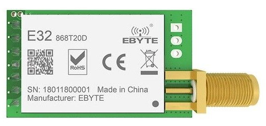

# Ebyte E32 series LoRa modules

## E32-868T20D

### Features
E32-868T20D is a wireless serial port module (UART) based on SEMTECH's SX1276 RF chip. It has multiple transmission modes working in the 862MHz~893MHz range (default 868MHz).

* Communication distance tested is up to 3km
* Maximum transmission power of 100mW, software multi-level adjustable;
* Support the global license-free ISM 868MHz band;
* Support air date rate of 0.3kbps~19.2kbps;
* Low power consumption for battery supplied applications;
* Support 2.3V~5.2V power supply;
* Industrial grade standard design, support -40 ~ 85 °C for working over a long time;
* SMA access point, Easy connection of coaxial cable or external antenna

### Pin layout

No|Pin|Description
--|---|-----------
1|M0*|Work with M1 to set 1 of 4 operating modes.
2|M1*|Work with M0 to set 1 of 4 operating modes.
3|RXD*|TTL UART input. Can be configured as open-drain or pull-up input.
4|TXD*|TTL UART output. Can be configured as open-drain or push-pull output.
5|AUX*|Indicates module’s working status. Can be configured as open-drain output orpush-pull output (floating is allowed).
6|VCC|Power (2.3~5.5V DC) 	
7|GND|Ground.

__* All communication pins are 3.3V only !!!__

### Operating modes

No|Mode|M1|M0|Description
--|----|--|--|-----------
0|Normal|0|0|UART and LoRa radio are on.
1|Wake Up|0|1|Same as normal but preamble code is added to transmitted data to wake up the receiver.
2|Power Save|1|0|UART is off, LoRa radio is on WOR(wake on radio) mode which means the device will turn on when there is data to be received. Transmission is not allowed.
3|Sleep|1|1|UART is on, LoRa radio is off. Is used to get/set module parameters or to reset the module.

### Module frequency

For the E32-868T20D, the minimum frequency is 862 MHz and the maximum is 893 MHz. The working frequency of the module is set by the __channel number__. The formula is :
* __Module frequency = Minimum frequency + channel_number * 1 MHz__
The default channel number for the E32-868T20D module is 6, so the working frequency defaults to 862 MHz + 6*1 MHz = 868 MHz

### Transmission modes

 

1. __Transparent transmission__
All modules have the same address and channel and can send/receive 
messages to/from each other (demo mode). The messages don't include address and channel information.

1. __Fixed transmission__
All modules can have different addresses and channels. The transmission messages are prefixed with the destination address and channel information. If these differ from the settings of the transmitter, then the configuration of the module will be changed before the transmission. After the transmission is complete, the configuration of the transmitter will revert to its prior configuration.

    1. __Fixed transmission P2P__
    The transmitted message has the address and channel information of the receiver. Only this module will receive the message. This is a point to point transmission between 2 modules.
    

    1. __Fixed transmission broadcast__
    The transmitted message has address FFFF and a channel. All modules with any address and the same channel will receive the message.
    

    1. __Fixed transmission monitoring__
    The receiver has adress FFFF and a channel. It will receive messages from all modules with any address and the same channel.

### Module configuration

The module can only be configured when in __sleep operating mode__ (M0 high & M1 high). __The UART baudrate has to be 9600 and parity 8N1.__

No|Command|Description
--|-------|-----------
1|C0 + config*|Set the configuration persistently. Send C0 + 5 configuration bytes in hex format.
2|C1+C1+C1|Get the module configuration. Send 3x C1 in hex format.
3|C2 + config*|Set the configuration temporary. Send C2 + 5 configuration bytes in hex format.
4|C3+C3+C3|Get the module version information. Send 3x C3 in hex format.
5|C4+C4+C4|Reset the module

* Default configuration parameters for E32-868T20D : __C0 00 00 1A 06 44__

#### Configuration bytes

#### Version bytes

No|Item|Description|Remark
--|----|-----------|------
0|HEAD|Header|0xC3
1|FREQ|Frequency (MHz)|0x32=433, 0x38=470, 0x45=868, 0x44=915, 0x46=170
2|VERS|Version number|0x0D
3|FEAT|Features number|0x14

### Test setup with ESP32

__Because the ESP32 is 3.3V, no voltage dividers are necessary to communicate with the E32 LoRa module__